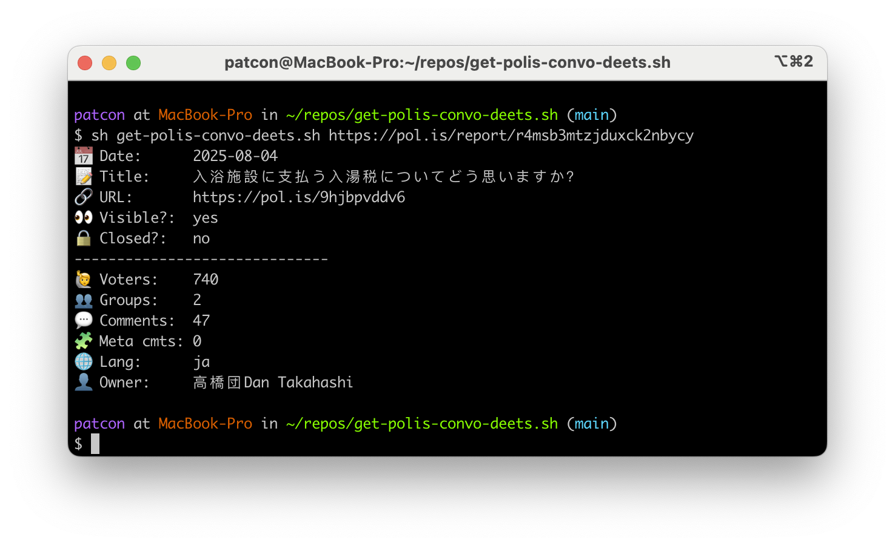

# get-polis-convo-deets.sh

A simple script for getting details about a Polis conversation on the command line.

I use this to update a spreadsheet of Polis conversations that I come across online.

See: https://docs.google.com/spreadsheets/d/1PnuFfLN8TNNA_7z83VAmczrmQYTzGEGA5hcQ9z5aP_8/edit?gid=0#gid=0
